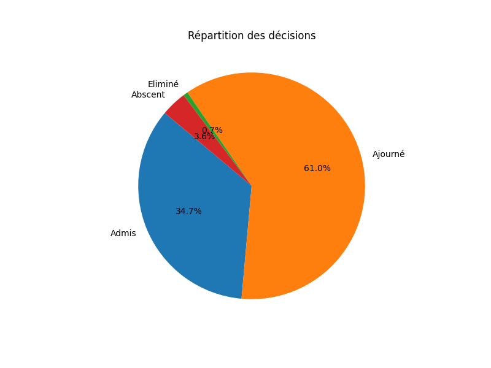
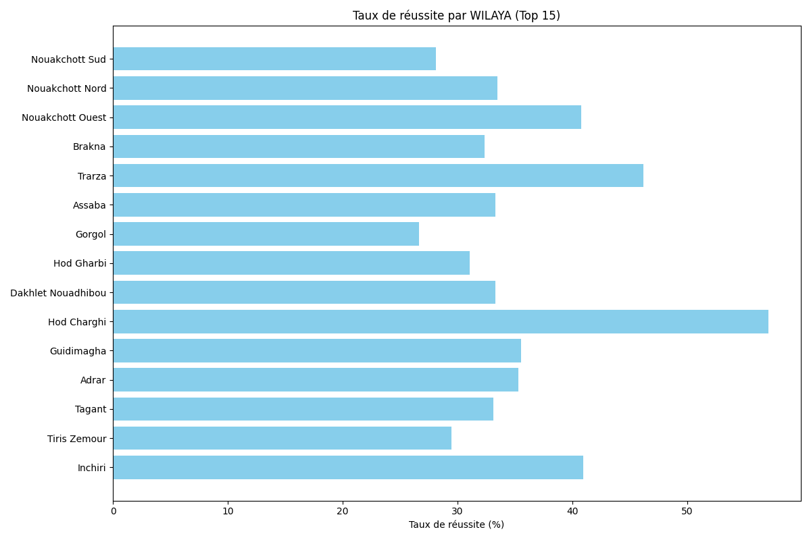
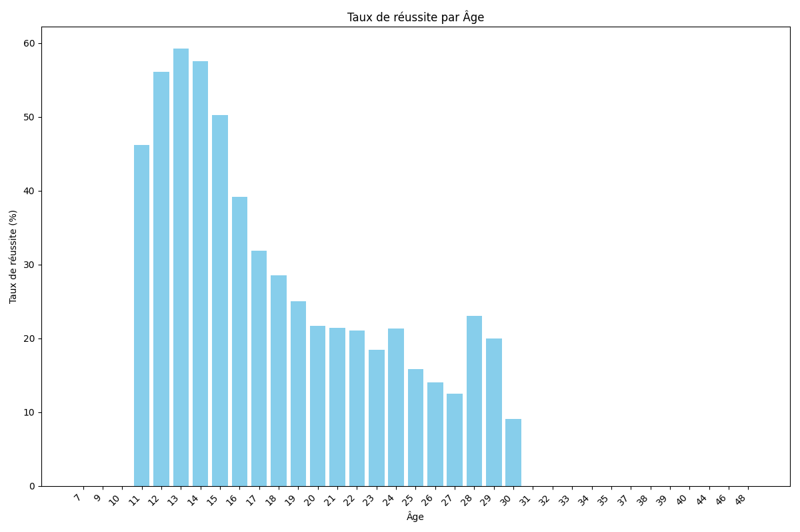

# brevet-cli

`brevet-cli` est un outil en ligne de commande développé en Python pour l'analyse des résultats des élèves à l'examen du BEPC 2025.

Il permet aux utilisateurs d'explorer les données de manière interactive, de rechercher des élèves spécifiques, de consulter des statistiques globales et de générer des visualisations de données pertinentes.

## Structure du Projet

```
/home/zeiny/brevet-cli/
├───README.md
├───student_analyzer.py
├───.git/
├───data/
│   ├───RESU_BEPC_2025_74821.csv
│   └───RESU_BEPC_2025_74821.xlsx
└───fig/
    ├───decision_distribution.png
    ├───pass_rate_by_Âge.png
    └───pass_rate_by_WILAYA.png
```

## Prérequis

*   Python 3
*   La bibliothèque `matplotlib`. Si elle n'est pas installée, le script vous proposera de l'installer automatiquement.

## Utilisation

Pour lancer l'application, exécutez le script `student_analyzer.py` depuis votre terminal :

```bash
python student_analyzer.py
```

Cela lancera un menu interactif dans la console.

### Menu Principal

Le menu principal vous présente toutes les options disponibles.

```
--- Menu Principal ---
1. Recherche avancée d'un étudiant
2. Recherche simple d'un étudiant
3. Afficher les statistiques générales
4. Afficher les statistiques par WILAYA
5. Afficher les statistiques par Âge
6. Générer tous les graphiques dans le dossier 'fig'
7. Quitter
Veuillez choisir une option (1-7) :
```

### Exemples d'Affichage

#### 1. Recherche avancée
Affiche toutes les informations disponibles pour un élève donné.

```
--- Résultat de la recherche avancée ---
Num_Bepc: 12345
NOM: DOE JOHN
LIEU_NAIS: QUELQUEPART
DATE_NAISS: 01/01/2009
WILAYA: ADAMAOUA
Ecole: LYCEE DE LA VILLE
Centre: CENTRE D'EXAMEN A
Moyenne_Bepc: 12.5
Decision: Admis
Âge: 16
```

#### 2. Recherche simple
Affiche les informations essentielles d'un élève.

```
--- Résultat de la recherche simple ---
NOM: DOE JOHN
Moyenne_Bepc: 12.5
Decision: Admis
```

#### 3. Statistiques générales
Donne un aperçu global des résultats.

```
Statistiques Générales:
------------------------
Nombre total d'étudiants : 74821
Nombre d'admis : 35000
Taux de réussite : 46.78%
Moyenne générale de tous les étudiants : 9.85
```

#### 4. Statistiques par WILAYA
Détaille les résultats pour chaque département.

```
Statistiques par WILAYA :
------------------------------------

WILAYA: LITTORAL
  Nombre d'étudiants : 15000
  Nombre d'admis : 8000
  Taux de réussite : 53.33%
  Moyenne : 10.15

WILAYA: CENTRE
  Nombre d'étudiants : 12000
  Nombre d'admis : 6000
  Taux de réussite : 50.00%
  Moyenne : 10.01
...
```

#### 5. Statistiques par Âge
Détaille les résultats en fonction de l'âge des candidats.

```
Statistiques par Âge :
------------------------------------

Âge: 15
  Nombre d'étudiants : 10000
  Nombre d'admis : 5500
  Taux de réussite : 55.00%
  Moyenne : 10.25

Âge: 16
  Nombre d'étudiants : 25000
  Nombre d'admis : 13000
  Taux de réussite : 52.00%
  Moyenne : 10.10
...
```

## Visualisations Générées

Le script peut générer plusieurs graphiques pour visualiser les tendances dans les données. Les graphiques sont sauvegardés dans le dossier `/fig`.

### Répartition des décisions


### Taux de réussite par WILAYA


### Taux de réussite par Âge
